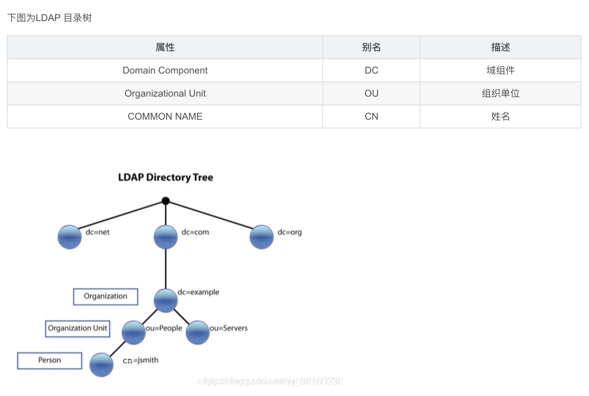

# 简介
LDAP(Lightweight Directory Access protocol)轻量级文件目录协议,LDAP目录中的信息采用树状的形式进行存储，具体
信息存储在条目(Entry)的数组结构中。条目相当于关系数据库中表的记录；条目是具有区别名DN （Distinguished Name）的属
性（Attribute），DN是用来引用条目的，DN相当于关系数据库表中的关键字（Primary Key）。属性由类型（Type）和一个或多
个值（Values）组成，相当于关系数据库中的字段（Field）由字段名和数据类型组成，只是为了方便检索的需要，LDAP中的Type可
以有多个Value，而不是关系数据库中为降低数据的冗余性要求实现的各个域必须是不相关的。LDAP中条目的组织一般按照地理位置和
组织关系进行组织，非常的直观。LDAP把数据存放在文件中，为提高效率可以使用基于索引的文件数据库，而不是关系数据库。类型的
一个例子就是mail，其值将是一个电子邮件地址。
                     


ldap简称说明
```text
o– organization（组织-公司）
ou – organization unit（组织单元-部门）
c - countryName（国家）
dc - domainComponent（域名）
sn – suer name（真实名称）
cn - common name（常用名称）
```


## 快速集成
```text
通过SpringBoot集成`spring-boot-starter-data-ldap`完成对LDAP的基本CRUD操作，并给出以登录
为实战的API实例。
```

### docker安装LDAP
参考文档: 
* [https://github.com/osixia/docker-openldap](https://github.com/osixia/docker-openldap)
```shell script
1. 下载镜像:  docker pull osixia/openldap:1.2.5
2. 运行容器: docker run -p 389:389 -p 636:636 --name my-openldap --detach osixia/openldap:1.2.5
3. 查询管理员: docker exec my-openldap ldapsearch -x -H ldap://localhost -b dc=example,dc=org -D "cn=admin,dc=example,dc=org" -w admin
   - 具体命令说明可以通过: docker exec -it [docker container id] bash 进去后,ldapsearch --help命令来进行查看
```

### SpringBoot集成
1. 添加依赖
```xml
<dependency>
  <groupId>org.springframework.boot</groupId>
  <artifactId>spring-boot-starter-data-ldap</artifactId>
</dependency>
```
2. 添加配置
```yaml
spring:
  ldap:
    urls: ldap://localhost:389
    base: dc=example,dc=org
    username: cn=admin,dc=example,dc=org
    password: admin
```
3. 添加映射实体类
- Person
```java


```

